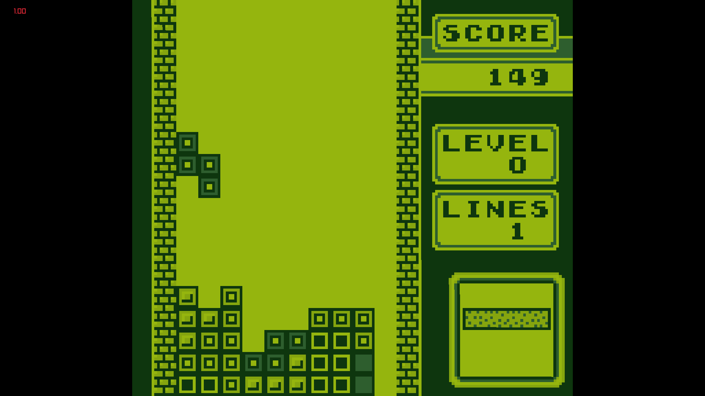

# Gearboy

A basic Gameboy emulator written in C++, for educational purposes.



Heavily influenced by [LLD](https://github.com/rockytriton/LLD_gbemu)'s  [youtube playlist](https://www.youtube.com/playlist?list=PLVxiWMqQvhg_yk4qy2cSC3457wZJga_e5).


## How to run
```
./GBRay [path_to_rom]
```


## Build Instruction

### Linux
```
git clone https://github.com/unexploredtest/GBRay.git
cd GBRay
git submodule update --init --recursive
mkdir build
cd build
cmake ..
make
```


## Documents and resources used:

https://github.com/rockytriton/LLD_gbemu

https://gbdev.io/pandocs/

https://www.pastraiser.com/cpu/gameboy/gameboy_opcodes.html

https://github.com/rockytriton/LLD_gbemu/raw/main/docs/

The%20Cycle-Accurate%20Game%20Boy%20Docs.pdf
